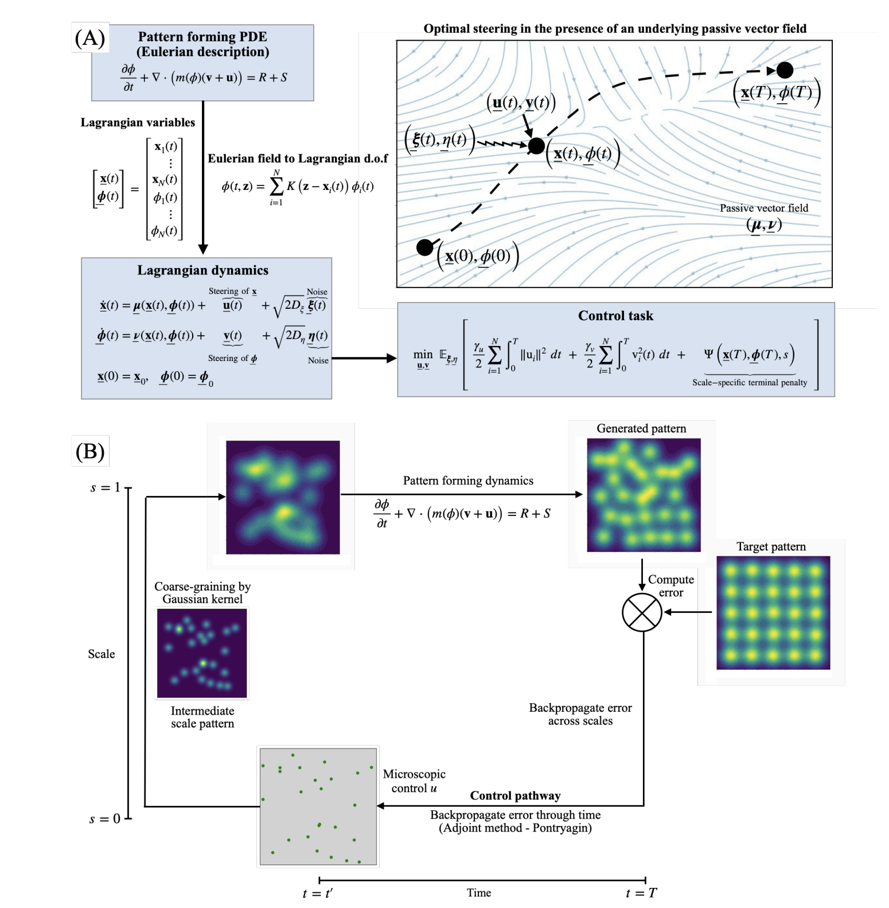

# Hamiltonian-Bridge
Hamiltonian bridge: A physics-driven generative framework for
targeted pattern control




## 📌 Overview
This repository contains **codes** and  **Jupyter Notebook** file used in our paper:

> **"Hamiltonian bridge: A physics-driven generative framework for
targeted pattern control"**  
> **Authors:** Vishaal Krishnan, Sumit Sinha, and L. Mahadevan  
> **Published in:** *arXiv:2410.12665*
> **DOI:** [https://arxiv.org/abs/2410.12665](https://arxiv.org/abs/2410.12665)  


## 📜 Citation
If you use this code in your research, please cite our paper:
```bibtex
@article{krishnan2024hamiltonian,
  title={Hamiltonian bridge: A physics-driven generative framework for targeted pattern control},
  author={Krishnan, Vishaal and Sinha, Sumit and Mahadevan, L},
  journal={arXiv preprint arXiv:2410.12665},
  year={2024}
}
```
